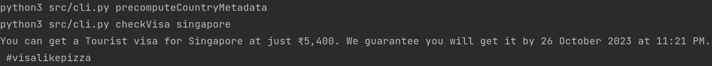
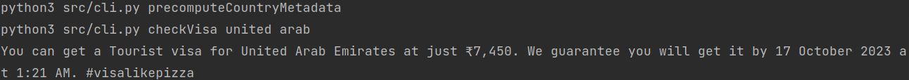
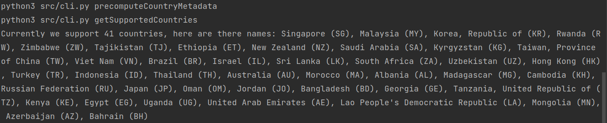

# AtlysCLI

A CLI tool to fetch visa details for a country

# Features
-> Scrapes visa related information from atlys.com
-> You don't need to enter the exact country name, the tool will do a fuzzy search
-> Not sure which countries you want to explore? Just ask to show all the countries supported

# Installation
This CLI would work in debian OS with make installed

Install dependencies
```commandline
make setup
```

That's it

# Usage

Check visa details for any country
```commandline
make checkVisa country=singapore
```



For countries whose name can have multiple words, use double quotes in the command
```commandline
make checkVisa country="united arab"
```



To check all the supported countries
```commandline
make getSupportedCountries
```



# Future Extensions
-> Currently this tool is fetching a static react file containing country related data. This might not work after
deployments on atlys.com. This can be extended to instead scrape the home page and derive list of countries supported

-> More visa related details can be scraped 

